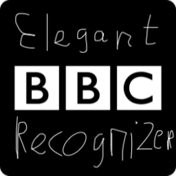
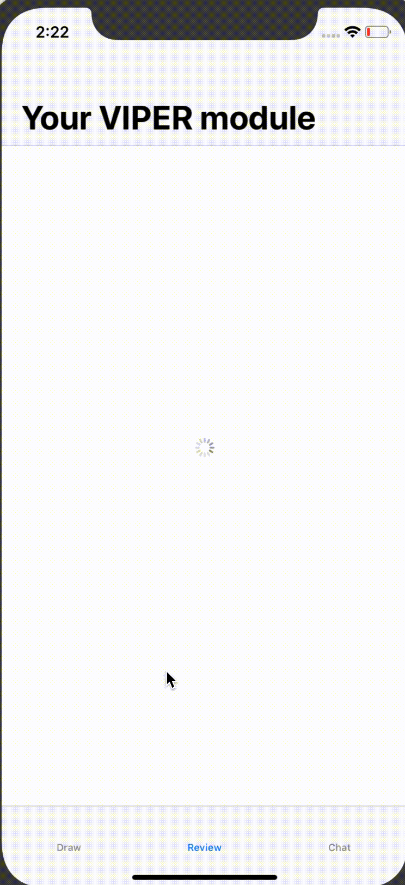
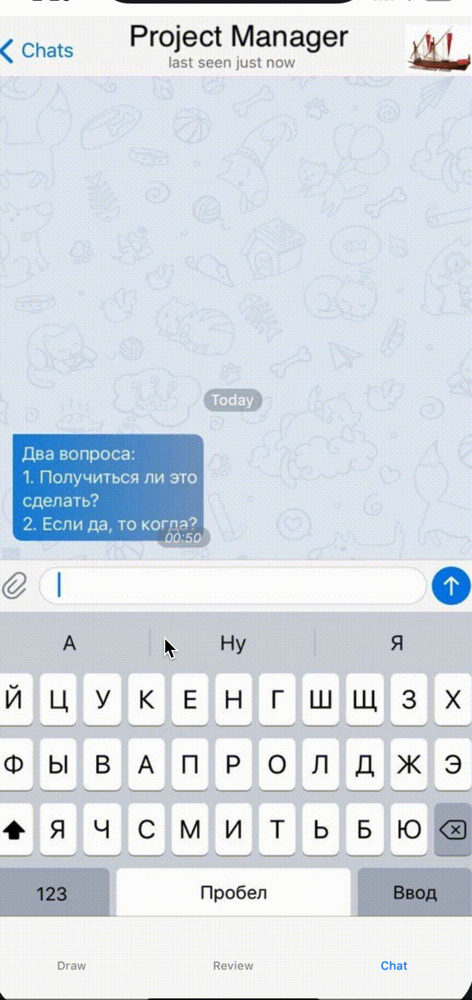

# BBCGestureRecognizer

[](https://travis-ci.org/Alamofire/Alamofire)
[](https://cocoapods.org/pods/Quick)
[](https://github.com/Carthage/Carthage)
[](https://alamofire.github.io/Alamofire)




BBCGestureRecognizer is the perfect instrument to handle users draw Big Black Cock on the screen. 

**⚠️⚠️⚠️ WARNING ⚠️⚠️⚠️** I really need your samples lo train classification model. Feel free to open pull request with BBC pictures drawn by your own.

## Demo
Feel free to checkout sample app and play around it. 


## Use cases
### Review
We all know, you are not very smart guy. You release shit quite often... 
User is observing bugs and infinite loading. He might want to draw cock on screen. This is not a big problem, we all do that to relax. 
When he finish his creation - he is absolutely happy. Just remember ur feelings after finishing such pictures...
*AND THEN BANG!!!* It's time to suggest him to review your app. Obviously he will appreciate your great sense of humour and give u five stars.



### Chat
Such a great idea to embed just another fucking chat in your app. But if u already did that, add this feature for fast short *fuck off* answer. 
*Keep it simple*



## Features
- [x] The only rational usage of CoreML and Vision.
- [x] Best experience of discovering BBCGesture on github (verified). 
- [x] Comprehensive Unit and Integration Test Coverage.
- [x] Fully implemented with Swift
- [x] If u want to draw cock in ur office - just clone my project. There is nothing to hide, u r just surfing github, looking for new technologies.
- [x] To be honest guys, this is funny. But maybe not for u.

## Requirements
iOS 10.0+ / macOS 10.12+ / tvOS 10.0+ / watchOS 3.0+
Xcode 10.1+
Swift 4.2+

## Communication
- If you **need help with BBC meaning**, use [Pornhub](https://www.pornhub.com/video/search?search=bbc).
- If you need to **get the joke** please google "post irony" and "self irony". If still doesn't help, sorry. I was drunk and that seemed to be the most hilarous idea in da world for me.
- If you'd like to **discuss BBC best practices**, feel free to open issue or post smthing in twitter
- If you **found a bug**, it doesn't not amaze me.
- If you **want to contribute**, submit a pull request.

## Installation

### CocoaPods
[CocoaPods](https://cocoapods.org) is a dependency manager for Cocoa projects. For usage and installation instructions, visit their website. To integrate Alamofire into your Xcode project using CocoaPods, specify it in your `Podfile`:

```ruby
pod 'BBCGestureRecognizer', '~> 8=========D'
```

### Carthage
[Carthage](https://github.com/Carthage/Carthage) is a decentralized dependency manager that builds your dependencies and provides you with binary frameworks. To integrate BBCGestureRecognizer into your Xcode project using Carthage, specify it in your `Cartfile`:

```ogdl
github "MortyMerr/BBCGestureRecognizer" "8=========D"
```

### Swift Package Manager
The [Swift Package Manager](https://swift.org/package-manager/) is a tool for automating the distribution of Swift code and is integrated into the `swift` compiler. What is already dead cannot die, so fuck it, use CocoaPods.

### Manually
If you prefer not to use any of the aforementioned dependency managers, you are not very smart guy and my project is not for you.

## Credits
BBCGestureRecognizer is owned and maintained by the most talented iOS developer in the world. You can follow me on Twitter at @M0rtyMerr for project updates and releases.

## Security Disclosure
If you believe you have identified a security vulnerability or bitcoin miner with BBCGestureRecognizer, you should report it as soon as possible via email to lolpoveril@gmail.org. Please do not post it to a public issue tracker. 

## Donations
Every opened PR with BBC image is better even than $20 for me.

## Author
Anton Nazarov, https://twitter.com/@M0rtyMerr

## License
BBCGestureRecognizer is available under the MIT license. See the LICENSE file for more info.
